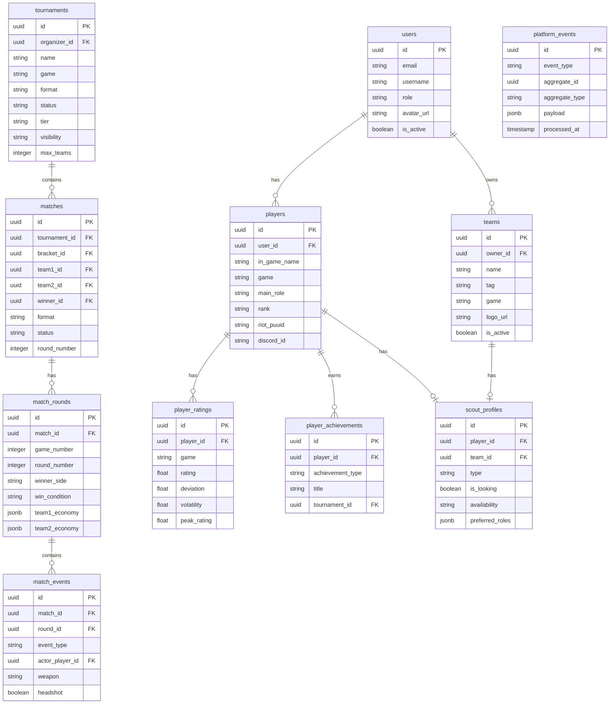

# ER Diagram

```mermaid
erDiagram
    users {
        uuid id PK
        string email
        string username
        string role
        string avatar_url
        boolean is_active
    }

    players {
        uuid id PK
        uuid user_id FK
        string in_game_name
        string game
        string main_role
        string rank
        string riot_puuid
        string discord_id
    }

    teams {
        uuid id PK
        uuid owner_id FK
        string name
        string tag
        string game
        string logo_url
        boolean is_active
    }

    tournaments {
        uuid id PK
        uuid organizer_id FK
        string name
        string game
        string format
        string status
        string tier
        string visibility
        integer max_teams
    }

    matches {
        uuid id PK
        uuid tournament_id FK
        uuid bracket_id FK
        uuid team1_id FK
        uuid team2_id FK
        uuid winner_id FK
        string format
        string status
        integer round_number
    }

    match_rounds {
        uuid id PK
        uuid match_id FK
        integer game_number
        integer round_number
        string winner_side
        string win_condition
        jsonb team1_economy
        jsonb team2_economy
    }

    match_events {
        uuid id PK
        uuid match_id FK
        uuid round_id FK
        string event_type
        uuid actor_player_id FK
        string weapon
        boolean headshot
    }

    player_ratings {
        uuid id PK
        uuid player_id FK
        string game
        float rating
        float deviation
        float volatility
        float peak_rating
    }

    player_achievements {
        uuid id PK
        uuid player_id FK
        string achievement_type
        string title
        uuid tournament_id FK
    }

    scout_profiles {
        uuid id PK
        uuid player_id FK
        uuid team_id FK
        string type
        boolean is_looking
        string availability
        jsonb preferred_roles
    }

    platform_events {
        uuid id PK
        string event_type
        uuid aggregate_id
        string aggregate_type
        jsonb payload
        timestamp processed_at
    }

    users ||--o{ players : "has"
    users ||--o{ teams : "owns"
    players ||--o{ player_ratings : "has"
    players ||--o{ player_achievements : "earns"
    players ||--o| scout_profiles : "has"
    teams ||--o| scout_profiles : "has"
    tournaments ||--o{ matches : "contains"
    matches ||--o{ match_rounds : "has"
    match_rounds ||--o{ match_events : "contains"
```
