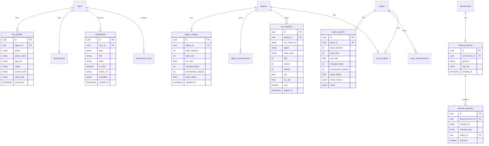
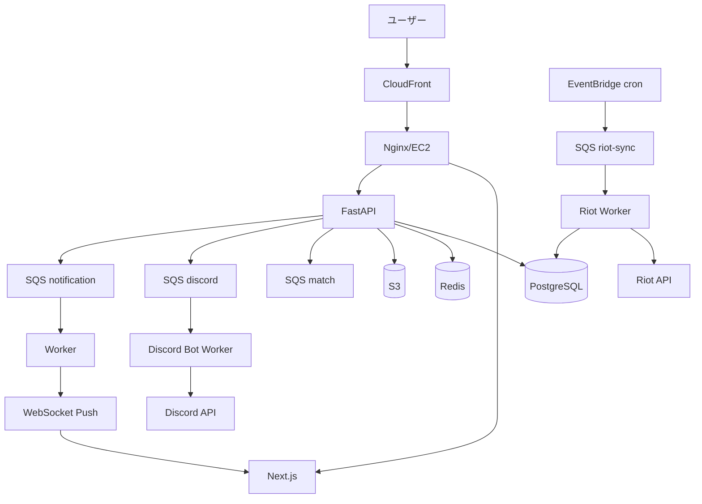

# eSports Operating System — 設計書

> 既存プラットフォームを統合運用基盤へ進化させる設計。
> 技術スタック不変（Next.js / FastAPI / SQLAlchemy / AWS / Terraform）。

---

## 1. 要件定義

### ビジョン
大会運営者・チーム・選手・観戦者の全員が、**Discordを開かずにプラットフォーム内で完結**できる運用OS。

### 機能要件サマリ
| # | 機能 | 目的 | 状態 |
|---|---|---|---|
| F1 | Discord Tournament Automation | 大会運営自動化 | 設計+Bot構成 |
| F2 | Tournament Hub | 大会専用ポータル | 既存拡張 |
| F3 | Player Career Platform | 横断戦績蓄積 | 実装 |
| F4 | Team Career Platform | チーム長期データ | 実装 |
| F5 | Team Scout Platform | マッチング | 既存拡張 |
| F6 | Notification Center | 通知統合 | **完全実装** |
| F7 | Riot Integration | VALORANT連携 | 設計+構成 |

### 非機能要件
- リアルタイム通知（WebSocket Push）
- 未ログイン閲覧（SEO/OGP対応）
- 全大会横断のデータ永続化
- Email通知への拡張可能設計

---

## 2. DB設計（新規テーブル）

```
player_careers      … 選手の横断集計（総試合/勝率/優勝回数/最高レート）
team_careers        … チームの横断集計
player_achievements … MVP/Champion/Top Fragger 等（既存005で作成済）
team_achievements   … 優勝/準優勝 等（既存005で作成済）
discord_servers     … 大会↔Discordサーバー紐付け
discord_channels    … 自動生成チャンネル管理
discord_links       … ユーザー↔Discord OAuth紐付け
scout_profiles      … スカウト募集（既存005で作成済）
recruitment_posts   … 募集掲載（チーム/選手）
notifications       … 通知本体
riot_profiles       … Riot ID紐付け + PUUID
riot_matches        … Riot APIから取得した試合データ
```

詳細は migration `006_esports_os.py` 参照。

---

## 3. ER図



---

## 4. API設計

### Notification（F6）
```
GET    /api/v1/notifications              一覧（filter/search/cursor）
GET    /api/v1/notifications/unread-count 未読数
PATCH  /api/v1/notifications/{id}/read    既読
PATCH  /api/v1/notifications/read-all     一括既読
DELETE /api/v1/notifications/{id}         削除
WS     /ws/notifications                  リアルタイムPush
```

### Player Career（F3）
```
GET /api/v1/players/{id}/career         キャリア集計
GET /api/v1/players/{id}/achievements   実績一覧
GET /api/v1/players/{id}/history        大会横断履歴
GET /api/v1/players/{id}/rating-history レート推移
```

### Team Career（F4）
```
GET /api/v1/teams/{id}/career         チーム集計
GET /api/v1/teams/{id}/achievements   実績
GET /api/v1/teams/{id}/rivals         対戦頻度上位
GET /api/v1/teams/{id}/roster-history ロスター履歴
```

### Scout（F5）拡張
```
GET  /api/v1/scout/players      条件検索
GET  /api/v1/scout/teams        条件検索
GET  /api/v1/scout/recommend    レコメンド
POST /api/v1/scout/recruitments 募集掲載
GET  /api/v1/scout/recruitments 募集一覧
POST /api/v1/scout/apply        応募
```

### Discord（F1）
```
POST /api/v1/discord/setup/{tournament_id}  サーバーテンプレート生成依頼
POST /api/v1/discord/oauth/callback         OAuth紐付け
GET  /api/v1/discord/link                   紐付け状態
```

### Riot（F7）
```
POST /api/v1/riot/link              Riot ID紐付け
POST /api/v1/riot/sync/{player_id}  手動同期
GET  /api/v1/riot/profile/{player_id}
```

---

## 5. Discord Bot 構成

```
discord-bot/ (独立サービス: ECS Fargate or EC2同居)
├── bot.py              … discord.py エントリ
├── cogs/
│   ├── tournament.py   … /create-tournament, /bracket
│   ├── checkin.py      … /check-in
│   ├── match.py        … /report-result, /match
│   ├── team.py         … /team, /player
│   └── help.py         … /help
├── services/
│   ├── api_client.py   … プラットフォームAPIへの認証付きクライアント
│   └── template.py     … サーバーテンプレート生成
└── config.py

連携フロー:
  プラットフォーム ──SQS(discord-queue)──▶ Bot Worker ──discord.py──▶ Discord API
  Discord(/コマンド) ──HTTP──▶ プラットフォームAPI（Bot Token認証）

サーバーテンプレート:
  カテゴリ: 📢INFORMATION / 🎮TOURNAMENT / 🏆MATCHES / 🎙STREAM / 📝SUPPORT
  チャンネル: #announcements #rules #schedule #check-in #results #support #general
  ロール: Admin / Organizer / Captain / Player / Spectator
  試合開始 → match-001 等を🏆MATCHES配下に自動生成
  試合終了 → 📦ARCHIVE カテゴリへ移動
```

### Discord OAuth フロー
```
ユーザー → /api/v1/discord/oauth/login → Discord認可画面
        → callback?code=xxx → token交換 → discord_links保存
```

---

## 6. Riot 連携構成

```
Riot API（VALORANT, RSO + Match-V1）
   │
   ├── account-v1: Riot ID → PUUID
   ├── val-match-v1: PUUID → Match History
   └── val-ranked-v1: Rank情報

同期方式:
  手動: ユーザーが /api/v1/riot/sync を叩く
  定期: EventBridge cron(rate 24h) → SQS → Worker → Riot API → riot_matches

キャッシュ:
  Redis: riot:profile:{player_id} TTL 1h
  Rate Limit対策: トークンバケットでAPI呼び出し制御

反映先:
  riot_matches → player_careers 再計算
              → player_ratings (Glicko-2) 更新
              → scout_profiles の rating 更新
```

---

## 7. Terraform 追加構成

```hcl
# SQS: Discord専用キュー
resource "aws_sqs_queue" "discord" { name = "${prefix}-discord" }
resource "aws_sqs_queue" "discord_dlq" { name = "${prefix}-discord-dlq" }

# Secrets: Discord Bot Token / Riot API Key
resource "aws_ssm_parameter" "discord_bot_token" {
  name = "/${prefix}/discord/bot_token"
  type = "SecureString"
}
resource "aws_ssm_parameter" "riot_api_key" {
  name = "/${prefix}/riot/api_key"
  type = "SecureString"
}

# EventBridge: Riot定期同期
resource "aws_cloudwatch_event_rule" "riot_sync" {
  schedule_expression = "rate(24 hours)"
}

# IAM: Worker に SSM読取 + SQS権限追加
```

---

## 8. ディレクトリ構成（追加分）

```
backend/app/
├── api/v1/
│   ├── notifications.py   # F6
│   ├── discord.py         # F1
│   └── riot.py            # F7
├── models/
│   ├── notification.py
│   ├── career.py
│   ├── discord.py
│   └── riot.py
├── services/
│   ├── notification_service.py
│   ├── career_service.py
│   ├── discord_service.py
│   └── riot_service.py
└── workers/handlers/
    ├── discord_handler.py
    └── riot_sync_handler.py

frontend/src/
├── app/
│   ├── (auth)/notifications/page.tsx   # F6
│   ├── (public)/players/[id]/          # F3 タブ追加
│   └── (public)/teams/[id]/            # F4 タブ追加
├── features/
│   ├── notifications/{api,hooks,components}
│   ├── career/{api,hooks}
│   └── scout/{api,hooks,components}
├── store/notification-store.ts          # Zustand
└── components/notification-bell.tsx

discord-bot/   # 新規独立サービス
```

---

## 9. 全体アーキテクチャ図



---

## 10. 実装優先順位

1. **migration 006** — 全テーブル基盤
2. **Notification Center** — 完全実装（WS既存）
3. **Player/Team Career** — 集計サービス
4. **Scout拡張** — recommend/recruitment
5. **Discord Bot** — 独立サービス + SQS配線
6. **Riot Integration** — RSO + Match同期
