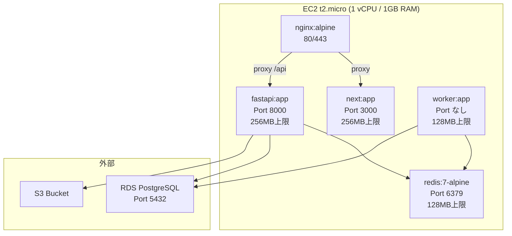
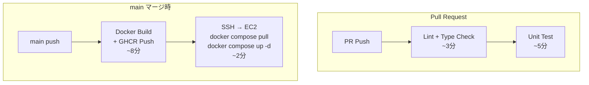
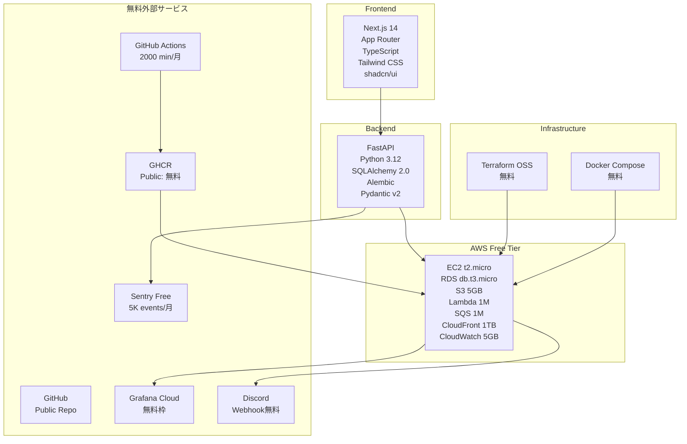
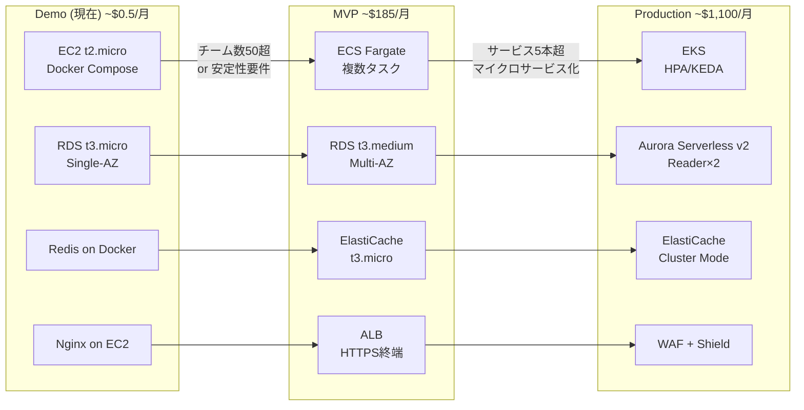
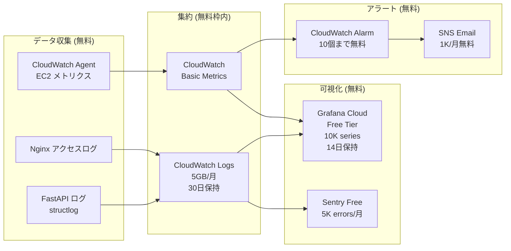
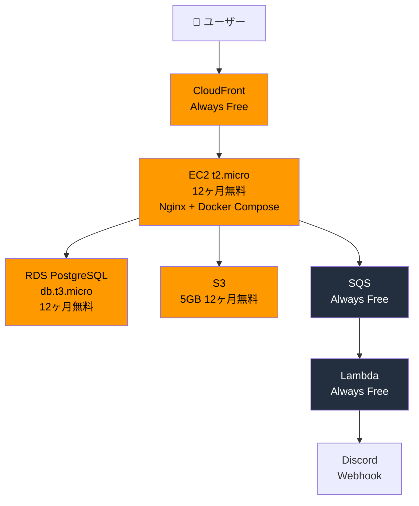

# Phase 1: 全体アーキテクチャ設計

## e-sports大会一元管理プラットフォーム

---

## 0. フェーズ定義

本プロジェクトは以下3フェーズで段階的にスケールする。

| フェーズ | 状態 | インフラ | 月額コスト |
|---------|------|---------|----------|
| **Demo（現在）** | PoC・個人開発・機能検証 | AWS無料枠 + 無料ツール | **~$0.50** |
| **MVP** | 小規模運用・数十チーム | ECS Fargate + RDS有料 | **~$185** |
| **Production** | 本格運用・数千チーム | EKS + Aurora | **~$1,100** |

> **本ドキュメントのスコープ:** Demoフェーズの設計を主軸とし、MVP/Production への升格パスを示す。

---

## 1. AWS 無料枠 利用方針

### Always Free（期限なし）

| サービス | 無料枠 | Demo での用途 | 超過リスク |
|---------|-------|-------------|-----------|
| **Lambda** | 1M リクエスト / 月, 400K GB-秒 | 通知処理・イベントハンドラ | デモ規模では超えない |
| **SQS** | 1M リクエスト / 月 | 非同期ジョブキュー | デモ規模では超えない |
| **SNS** | 1M pub / 月, 1K メール | アラート通知 | デモ規模では超えない |
| **CloudFront** | 1TB 転送 / 月, 10M リクエスト | CDN・静的配信 | デモ規模では超えない |
| **CloudWatch** | 10カスタムメトリクス, 5GB ログ | 監視・ログ | ログ量に注意 |
| **DynamoDB** | 25GB, 25 RCU/WCU | ※未使用（PostgreSQL優先） | - |
| **EventBridge** | $1/100万イベント (≒無料) | ドメインイベント発行 | デモ規模では超えない |

### 12ヶ月間無料（新規アカウント限定）

| サービス | 無料枠 | Demo での用途 | 期限後コスト |
|---------|-------|-------------|-----------|
| **EC2 t2.micro** | 750 時間 / 月 × 1台 | アプリ全体 (Docker Compose) | ~$8/月 |
| **RDS db.t3.micro** | 750 時間 / 月, 20GB | PostgreSQL | ~$13/月 |
| **S3** | 5GB, 2K PUT, 20K GET | 画像・エクスポート | ~$1/月 |
| **ECR** | 500MB | コンテナイメージ | ~$0.1/月 |
| **ACM** | 無制限 | SSL証明書 | 常に無料 |

### 無料枠外（最小コストで利用）

| サービス | コスト | 代替手段 |
|---------|-------|---------|
| **Route53** | $0.50/月（ホストゾーン） | EC2 パブリックIPを直接使用でも可 |
| **NAT Gateway** | $32/月 → **使わない** | パブリックサブネットで代替 |
| **ALB** | $6〜/月 → **使わない** | EC2上のNginxで代替 |
| **ElastiCache** | $15〜/月 → **使わない** | EC2上のRedis（Dockerコンテナ）で代替 |

### デモフェーズ 実質コスト

```
Route53（ホストゾーン）: $0.50/月
その他:                  $0.00/月
──────────────────────────
合計:                    $0.50/月
```

---

## 2. Demoフェーズ アーキテクチャ

### インフラ全体図

```mermaid
graph TB
    subgraph "ユーザー"
        WEB[Web Browser]
        MOBILE[Mobile Browser]
    end

    subgraph "AWS - 無料枠構成"
        subgraph "CDN (Always Free)"
            CF[CloudFront\n1TB/月無料\nSSL終端]
        end

        subgraph "DNS"
            R53[Route53\n$0.50/月\nまたはパブリックIP直接]
        end

        subgraph "VPC - Public Subnet のみ (NAT不使用)"
            subgraph "EC2 t2.micro (無料12ヶ月)"
                NGINX[Nginx\nリバースプロキシ]
                NEXT[Next.js\nDocker]
                API[FastAPI\nDocker]
                WORKER[Worker\nDocker (軽量)]
                REDIS_LOCAL[Redis\nDocker (揮発性)]
            end
        end

        subgraph "マネージドサービス"
            RDS[RDS db.t3.micro\nPostgreSQL 15\n20GB 無料12ヶ月]
            S3_BUCKET[S3\n5GB 無料12ヶ月\n画像・エクスポート]
            LAMBDA_FN[Lambda\n1M req/月 無料\n通知処理]
            SQS_Q[SQS\n1M req/月 無料\n非同期キュー]
        end

        subgraph "監視 (無料枠)"
            CW[CloudWatch\n5GB ログ無料\nBasic監視]
        end
    end

    subgraph "外部サービス (全て無料)"
        DISCORD[Discord Webhook\n無料]
        GITHUB[GitHub Actions\n2000 min/月 無料]
        GHCR[GitHub Container\nRegistry 無料]
        GRAFANA_CLOUD[Grafana Cloud\n無料 (3ユーザー)]
    end

    WEB --> CF
    MOBILE --> CF
    CF --> R53
    R53 --> NGINX
    NGINX --> NEXT
    NGINX --> API
    NGINX --> REDIS_LOCAL
    API --> RDS
    API --> S3_BUCKET
    API --> SQS_Q
    SQS_Q --> WORKER
    WORKER --> RDS
    WORKER --> LAMBDA_FN
    LAMBDA_FN --> DISCORD
    API --> CW
    CW --> GRAFANA_CLOUD
    GITHUB --> GHCR
    GHCR --> NGINX
```

### EC2 t2.micro 上の Docker Compose 構成



> **メモリ配分戦略:** t2.micro は 1GB RAM。Nginx(30MB) + Next.js(256MB) + FastAPI(256MB) + Worker(128MB) + Redis(128MB) + OS(200MB) = 約998MB。スワップ512MBを設定してバッファ確保。

---

## 3. 無料ツール構成（AWS以外）

| カテゴリ | ツール | 無料枠 / 条件 | 用途 |
|---------|-------|-------------|------|
| **ソースコード** | GitHub | パブリックリポジトリ: 無料 | コード管理 |
| **CI/CD** | GitHub Actions | 2,000 min/月 (private) / 無制限 (public) | ビルド・デプロイ |
| **コンテナ登録** | GitHub Container Registry (GHCR) | パブリック: 無料 | Dockerイメージ保存 |
| **IaC** | Terraform OSS | 無料 | インフラコード化 |
| **コンテナ** | Docker / Docker Compose | 無料 | ローカル開発・EC2デプロイ |
| **監視ダッシュボード** | Grafana Cloud | 無料 (3ユーザー, 10K series, 14日保持) | メトリクス可視化 |
| **エラー追跡** | Sentry Free | 5K イベント/月 | エラー監視 |
| **Discord** | Discord Webhook | 無料 | 大会通知 |
| **SSL証明書** | AWS ACM | 無料 (ALB/CloudFront利用時) | HTTPS化 |
| **ドメイン** | EC2パブリックIPまたはRoute53 | IP直接: 無料 / R53: $0.50/月 | アクセスURL |

---

## 4. 無料枠 制限・注意事項

### ⚠️ 超過で課金が発生するポイント

```
【EC2 t2.micro】
✅ 750 時間/月まで無料
⚠️ 2台目を立てると両方課金
⚠️ 12ヶ月後は $0.0116/時 (~$8.4/月) に課金開始
→ 対策: 開発中は停止、1台運用を維持

【RDS db.t3.micro】
✅ 750 時間/月、20GB まで無料
⚠️ 20GB超えると $0.115/GB-月
⚠️ Multi-AZ にすると2倍の時間カウント
⚠️ 12ヶ月後は $0.017/時 (~$12/月)
→ 対策: Single-AZ、バックアップ自動削除1日

【S3】
✅ 5GB、2,000 PUT、20,000 GET まで無料
⚠️ 画像アップロードが多いと PUT超過
→ 対策: アップロードサイズ制限 (5MB/ファイル)

【CloudWatch Logs】
✅ 5GB 取り込み無料
⚠️ 詳細ログを全部入れると超過しやすい
→ 対策: WARNING以上のみ収集、30日で自動削除

【CloudFront】
✅ 1TB 転送、10M リクエスト/月 Always Free
⚠️ 動画配信すると超えやすい
→ 対策: 動画配信はデモでは行わない

【Lambda】
✅ 1M リクエスト/月 Always Free
⚠️ 関数実行時間が長いと GB-秒超過
→ 対策: タイムアウト30秒に設定

【GitHub Actions】
✅ Public リポジトリ: 無制限
✅ Private リポジトリ: 2,000 分/月
⚠️ Docker Build は時間がかかる
→ 対策: Public リポジトリで運用、キャッシュ活用
```

### 無料枠 残量モニタリング

```bash
# AWS Cost Explorer を毎週確認
# Billing Alert を $1 で設定しておく（無料枠超過の早期検知）
```

---

## 5. 責務分離設計（Demoフェーズ）

```mermaid
graph LR
    subgraph "Presentation (EC2内)"
        NEXT2[Next.js\nApp Router\nSSR/SSG/CSR]
    end

    subgraph "API (EC2内)"
        FASTAPI[FastAPI\nREST + WebSocket\nJWT Auth]
    end

    subgraph "Async (EC2内 + Lambda)"
        WORKER2[Worker\nSQS Consumer]
        LMB[Lambda\n通知送信]
    end

    subgraph "Data"
        PG[RDS PostgreSQL]
        RDS2[Redis (Docker)]
        S32[S3]
    end

    NEXT2 -->|API Call| FASTAPI
    NEXT2 -.->|WebSocket| FASTAPI
    FASTAPI --> PG
    FASTAPI --> RDS2
    FASTAPI --> S32
    FASTAPI --> SQS_Q2[SQS]
    SQS_Q2 --> WORKER2
    SQS_Q2 --> LMB
    WORKER2 --> PG
```

---

## 6. ネットワーク設計（無料枠）

```mermaid
graph TB
    subgraph "VPC 10.0.0.0/16"
        subgraph "Public Subnet 10.0.1.0/24 (ap-northeast-1a)"
            EC2_BOX[EC2 t2.micro\n10.0.1.10]
        end

        subgraph "Public Subnet 10.0.2.0/24 (ap-northeast-1c)"
            RDS_BOX[RDS db.t3.micro\n(Subnet Group 用)]
        end

        IGW[Internet Gateway]
    end

    INET[Internet] --> IGW
    IGW --> EC2_BOX
    EC2_BOX -->|5432| RDS_BOX
```

> **NAT Gateway を使わない理由:**
> NAT Gateway は $0.045/時 ≒ $32/月。デモフェーズでは EC2 + RDS を Public Subnet に置き、Security Group で IP制限することで代替する。本番移行時にプライベートサブネット + NAT に移行する。

### Security Group 設計

| SG名 | インバウンド | 対象 |
|------|------------|------|
| `sg-ec2-demo` | 80 (HTTP), 443 (HTTPS) from 0.0.0.0/0, 22 (SSH) from 自宅IP | EC2 |
| `sg-rds-demo` | 5432 from sg-ec2-demo のみ | RDS |

---

## 7. CI/CD設計（GitHub Actions 無料枠）



```
月間 GitHub Actions 消費見積もり (Private Repo):
- PR: 8分 × 20回 = 160分
- Deploy: 10分 × 10回 = 100分
- 合計: 260分/月 (2,000分中13%) → 余裕あり

Public Repo 運用時: 無制限
```

---

## 8. デモフェーズ 技術スタック全体像



---

## 9. MVP / Production へのアップグレードパス



### アップグレード判断基準

| 指標 | Demo → MVP | MVP → Production |
|------|-----------|-----------------|
| 登録チーム数 | 50チーム超 | 500チーム超 |
| 月間アクティブユーザー | 200人超 | 5,000人超 |
| 同時接続数 | 30超 | 500超 |
| 無料枠期限 | 12ヶ月後 | - |
| ダウンタイム許容 | あり | なし |

---

## 10. セキュリティ設計（Demoフェーズ）

デモ規模でも最低限のセキュリティを実装する。

```
✅ 実装するもの:
- JWT認証 (HS256, Access 15min / Refresh 7day)
- HTTPS (CloudFront + ACM)
- Security Group による RDS アクセス制限
- SSH鍵認証のみ (パスワード無効化)
- 環境変数は .env (git管理外) + GitHub Actions Secrets
- CORS 設定 (許可Origin限定)
- SQLインジェクション対策 (SQLAlchemy ORM使用)
- XSS対策 (Pydantic バリデーション)
- Billing Alert $1設定

❌ Demoフェーズでは省略:
- WAF (有料)
- GuardDuty (有料)
- Secrets Manager (有料、.env で代替)
- CloudTrail 詳細 (ログコスト節約)
- Multi-AZ RDS (無料枠外)
- VPCフローログ (ログコスト)
```

---

## 11. 監視設計（無料枠）



### CloudWatch ログ節約設定

```python
# WARNING以上のみCloudWatchへ送信（容量節約）
# DEBUGはローカルファイルへ
LOGGING_CONFIG = {
    "handlers": {
        "cloudwatch": {"level": "WARNING"},  # 5GB枠を節約
        "local": {"level": "DEBUG"},
    }
}

# ログ保持期間: 30日に設定（デフォルト無期限は危険）
```

---

## 12. アーキテクチャ概要図（Mermaid - GitHub表示用）



---

## 13. 次フェーズへの接続

| フェーズ | 内容 | 変更点 |
|---------|------|-------|
| **Phase 2** | DB設計 | 変更なし（スキーマは将来も同じ） |
| **Phase 3** | FastAPI実装 | デモ向けに軽量化（非同期最小限） |
| **Phase 4** | Next.js実装 | 変更なし |
| **Phase 5** | 分析基盤 | Demoではローカル集計（S3/Athena は MVP以降） |
| **Phase 6** | Terraform | Demoフェーズ用 `environments/demo/` を追加 |
| **Phase 7** | Kubernetes | MVP以降で検討 |
| **Phase 8** | CI/CD | GitHub Actions（無料枠内で完結） |
| **Phase 9** | README | 無料枠の制限を全て記載 |
