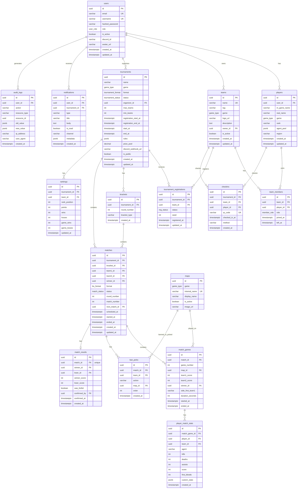
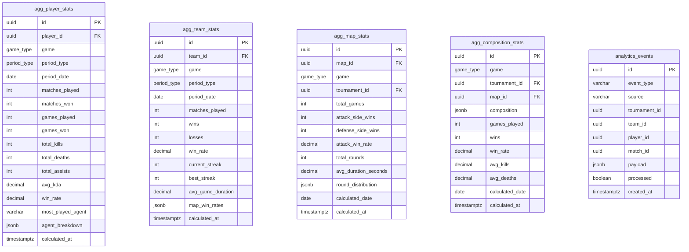

# Phase 2: データベース設計

---

## 1. PostgreSQL 採用理由

| 観点 | PostgreSQL | MySQL | MongoDB |
|------|-----------|-------|---------|
| **JSONB** | ネイティブ対応・インデックス可 | JSON型（遅い） | ドキュメント型 |
| **複雑なクエリ** | CTE, Window関数, 集合演算 | 限定的 | 限定的 |
| **トランザクション** | ACID完全対応 | ACID対応 | 結果整合性 |
| **配列型** | ネイティブ配列型 | なし | なし |
| **全文検索** | tsvector / GIN | 限定的 | Atlas Search |
| **分析クエリ** | Partitioning, BRIN Index | 限定的 | 不向き |
| **AWSマネージド** | Aurora PostgreSQL | Aurora MySQL | DocumentDB |

**採用理由まとめ:**
- JSONB 型で `custom_stats`（ゲーム固有統計）を柔軟に格納
- Window関数でランキング計算を DB 側で完結
- 将来的な BigQuery 連携は pg_dumpall → GCS → BQ の標準パスが存在
- Aurora PostgreSQL Serverless v2 でコスト最適化可能

---

## 2. テーブル一覧

### コアテーブル

| テーブル | 行数想定 | 説明 |
|---------|---------|------|
| `users` | ~10万 | プラットフォームユーザー |
| `players` | ~10万 | 選手プロフィール |
| `teams` | ~1万 | チーム情報 |
| `team_members` | ~5万 | チームメンバー関連 |
| `tournaments` | ~5千 | 大会情報 |
| `tournament_registrations` | ~5万 | 大会参加申請 |
| `brackets` | ~2万 | トーナメント構造 |
| `matches` | ~10万 | 試合情報 |
| `match_games` | ~30万 | BO3各ゲーム |
| `ban_picks` | ~100万 | Map Ban/Pick |
| `match_results` | ~10万 | 試合結果 |
| `player_match_stats` | ~500万 | 選手別試合統計 |
| `maps` | ~100 | マップマスタ |

### 運用テーブル

| テーブル | 行数想定 | 説明 |
|---------|---------|------|
| `notifications` | ~100万 | 通知 |
| `checkins` | ~50万 | QRチェックイン |
| `audit_logs` | ~1000万 | 操作ログ |
| `rankings` | ~5万 | ランキング |

### 分析テーブル

| テーブル | 行数想定 | 説明 |
|---------|---------|------|
| `analytics_events` | ~1億 | 生イベント（S3連携） |
| `agg_player_stats` | ~100万 | 選手日次集計 |
| `agg_team_stats` | ~20万 | チーム日次集計 |
| `agg_map_stats` | ~10万 | マップ統計集計 |
| `agg_composition_stats` | ~50万 | 構成統計集計 |

---

## 3. ER図



---

## 4. 正規化方針

### 第3正規形 (3NF) 基本方針

```
非正規 → 1NF → 2NF → 3NF を基本とする
JSONB は意図的な非正規化（柔軟性のトレードオフ）
```

| テーブル | 設計判断 | 理由 |
|---------|---------|------|
| `player_match_stats.custom_stats` | JSONB（非正規化） | ゲームごとに異なる統計項目 |
| `tournaments.rules` | JSONB（非正規化） | 大会ごとに異なるルール |
| `players.agent_pool` | JSONB配列 | 順序つき得意エージェントリスト |
| `matches` | 完全正規化 | 試合の中核データは厳密に |
| `rankings` | 非正規化（集計値） | 読み取り性能最優先 |
| `agg_*` テーブル | 意図的な非正規化 | 分析クエリ高速化 |

---

## 5. インデックス戦略

### 検索パターン別インデックス設計

```sql
-- ===== users =====
CREATE INDEX idx_users_email ON users(email);
CREATE INDEX idx_users_discord_id ON users(discord_id) WHERE discord_id IS NOT NULL;

-- ===== tournaments =====
CREATE INDEX idx_tournaments_game ON tournaments(game);
CREATE INDEX idx_tournaments_status ON tournaments(status);
CREATE INDEX idx_tournaments_start_at ON tournaments(start_at DESC);
CREATE INDEX idx_tournaments_organizer ON tournaments(organizer_id);
-- 複合: 一覧取得の高速化
CREATE INDEX idx_tournaments_game_status ON tournaments(game, status, start_at DESC);

-- ===== matches =====
CREATE INDEX idx_matches_tournament ON matches(tournament_id);
CREATE INDEX idx_matches_status ON matches(status);
CREATE INDEX idx_matches_scheduled ON matches(scheduled_at) WHERE status = 'scheduled';
CREATE INDEX idx_matches_teams ON matches(team1_id, team2_id);
-- 次の試合への遷移
CREATE INDEX idx_matches_next ON matches(next_match_id) WHERE next_match_id IS NOT NULL;

-- ===== player_match_stats =====
CREATE INDEX idx_pms_player ON player_match_stats(player_id);
CREATE INDEX idx_pms_match_game ON player_match_stats(match_game_id);
CREATE INDEX idx_pms_agent ON player_match_stats(agent);
-- 分析クエリ用複合
CREATE INDEX idx_pms_player_agent ON player_match_stats(player_id, agent);

-- ===== rankings =====
CREATE INDEX idx_rankings_tournament ON rankings(tournament_id, rank_position ASC);
CREATE INDEX idx_rankings_team ON rankings(team_id);
-- Global ranking
CREATE INDEX idx_rankings_global ON rankings(rank_position ASC) WHERE tournament_id IS NULL;

-- ===== audit_logs =====
-- BRIN: 時系列データに有効（B-treeより軽量）
CREATE INDEX idx_audit_logs_created_brin ON audit_logs USING BRIN(created_at);
CREATE INDEX idx_audit_logs_user ON audit_logs(user_id, created_at DESC);
CREATE INDEX idx_audit_logs_resource ON audit_logs(resource_type, resource_id);

-- ===== notifications =====
CREATE INDEX idx_notifications_user_unread ON notifications(user_id, is_read, created_at DESC)
    WHERE is_read = false;

-- ===== analytics_events =====
-- パーティショニングで月ごとに分割（後述）
CREATE INDEX idx_events_type ON analytics_events(event_type, created_at DESC);
CREATE INDEX idx_events_tournament ON analytics_events(tournament_id, created_at DESC)
    WHERE tournament_id IS NOT NULL;

-- ===== agg_player_stats =====
CREATE UNIQUE INDEX idx_agg_player_unique ON agg_player_stats(player_id, game, period_type, period_date);
CREATE INDEX idx_agg_player_lookup ON agg_player_stats(player_id, game, period_type, period_date DESC);

-- ===== agg_map_stats =====
CREATE UNIQUE INDEX idx_agg_map_unique ON agg_map_stats(map_id, tournament_id, calculated_date)
    NULLS NOT DISTINCT;
```

### テーブルパーティショニング

```sql
-- audit_logs: 月次パーティション（大量データ対策）
CREATE TABLE audit_logs (
    ...
    created_at timestamptz NOT NULL
) PARTITION BY RANGE (created_at);

CREATE TABLE audit_logs_2024_01 PARTITION OF audit_logs
    FOR VALUES FROM ('2024-01-01') TO ('2024-02-01');
-- 毎月自動作成（Lambda or pg_partman）

-- analytics_events: 同様に月次パーティション
CREATE TABLE analytics_events (
    ...
    created_at timestamptz NOT NULL
) PARTITION BY RANGE (created_at);
```

---

## 6. 分析用テーブル設計



---

## 7. 将来的なBigQuery / Redshift 連携案

```
PostgreSQL (Operational)
        │
        ▼
[nightly pg_dump or Debezium CDC]
        │
        ▼
S3 Data Lake (Parquet形式)
        │
    ┌───┴───┐
    ▼       ▼
BigQuery   Redshift
(分析)     (既存AWS統合)
    │
    ▼
Looker Studio / QuickSight
```

### CDC (Change Data Capture) 設計

```
Debezium (PostgreSQL WAL) → Kafka → S3 → Glue Catalog → Athena/BigQuery

メリット:
- リアルタイムに近いデータ同期（秒単位）
- アプリコードの変更不要
- 削除・更新も追跡可能

MVP では: 日次 pg_dump → S3 → Glue ETL（シンプル）
拡張版では: Debezium + Kafka Connect → S3
```

---

## 8. PostgreSQL 最適化設定

```sql
-- postgresql.conf 推奨設定 (RDS Parameter Group)

-- メモリ設定 (db.t3.medium = 4GB RAM 想定)
shared_buffers = 1GB                    -- RAM の 25%
effective_cache_size = 3GB              -- RAM の 75%
work_mem = 64MB                         -- ソート/ハッシュ用
maintenance_work_mem = 256MB            -- VACUUM/CREATE INDEX用

-- WAL 設定
wal_level = logical                     -- Debezium CDC 対応
max_wal_size = 2GB
checkpoint_completion_target = 0.9

-- 接続設定
max_connections = 200                   -- RDS Proxy 経由で管理
idle_in_transaction_session_timeout = 30000  -- 30秒でタイムアウト

-- クエリ最適化
random_page_cost = 1.1                  -- SSD対応 (デフォルト4.0から下げる)
effective_io_concurrency = 200          -- SSD IOPS
parallel_tuple_cost = 0.1
max_parallel_workers_per_gather = 4

-- 自動バキューム
autovacuum_vacuum_scale_factor = 0.05   -- 5%更新でVACUUM
autovacuum_analyze_scale_factor = 0.02  -- 2%更新でANALYZE
```

---

*このドキュメントはPhase 2のDB設計を定義します。*
*SQLAlchemyモデルとAlembicマイグレーションは backend/ ディレクトリに実装されます。*
